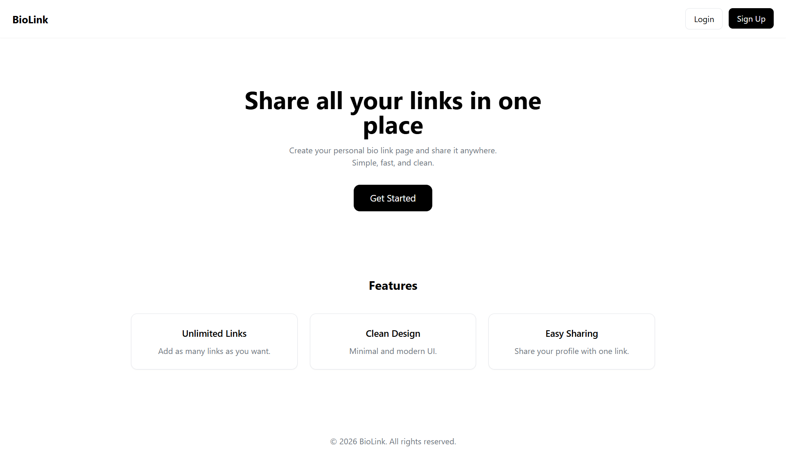
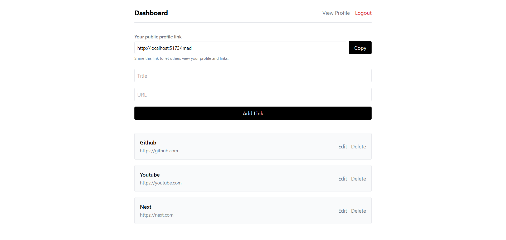
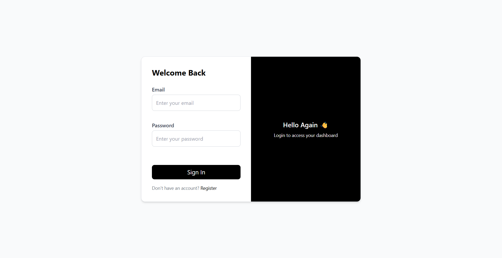
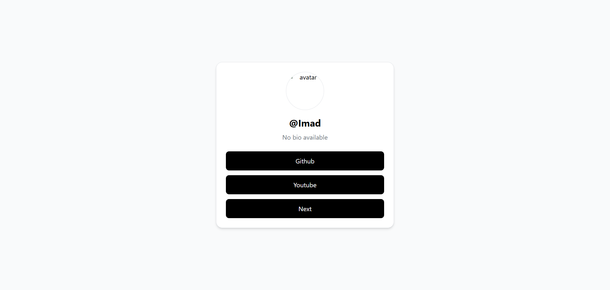

# 🔗 BioLinkTool

A modern full-stack web application that allows users to create and manage a personalized bio link page.

## 🚀 Features

- 🔐 User authentication (Register / Login)
- 🔗 Add, edit, and delete links
- 👤 Custom user profile page
- 📱 Fully responsive design (Mobile friendly)
- ⚡ Fast and smooth user experience
- 🎨 Clean and modern UI

## 🛠️ Tech Stack

- Frontend: React, Tailwind CSS
- Backend: Node.js, Express
- Database: MongoDB (Mongoose)
- Authentication: JWT

## 📸 Screenshots

## 🌐 Live Demo

[View Live Project](#)

## 💡 About the Project

This project was built to practice full-stack development by creating a real-world application with authentication, database integration, and a modern UI/UX.

## 📬 Contact

Feel free to reach out or connect with me!
